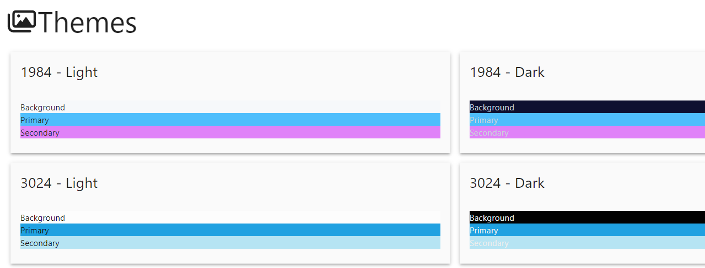

# Dashboard Utilities

Utility functions for PowerShell Universal Dashboard

## Get-UDCache

Returns the current values in the `$Cache` scope.

## Reset-UDPage

Reloads the current page.

## Show-UDEventData

Shows the `$EventData` variable in a modal as JSON.

## Show-UDObject

Shows an object in a modal in a table.

## Show-UDThemeColorViewer

Shows all the theme colors in a modal.

## Show-UDVariable

Shows variables and their values in a modal.

